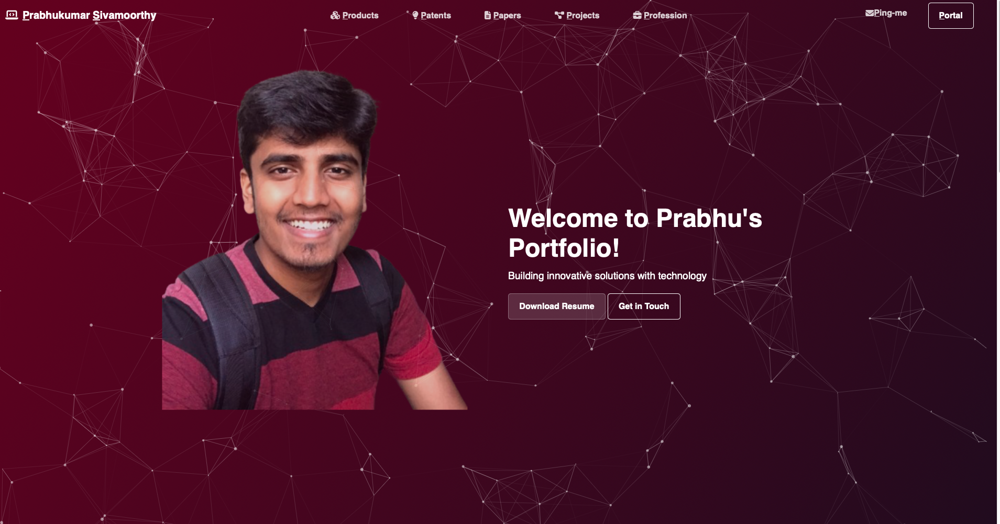
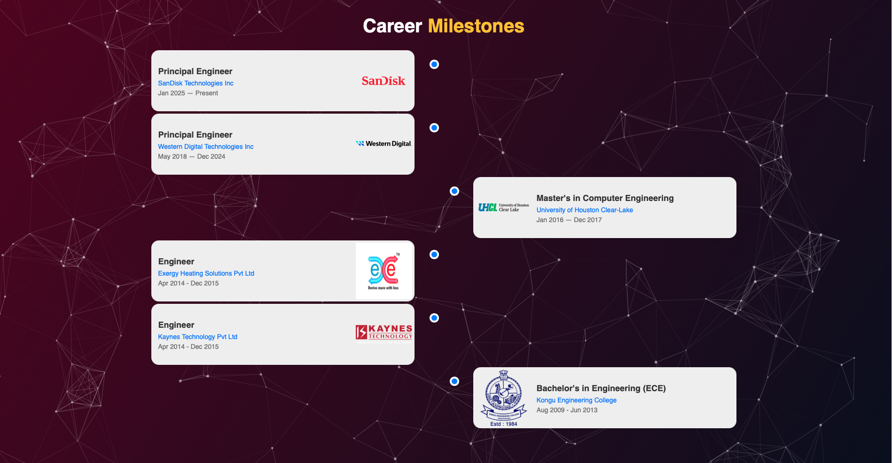
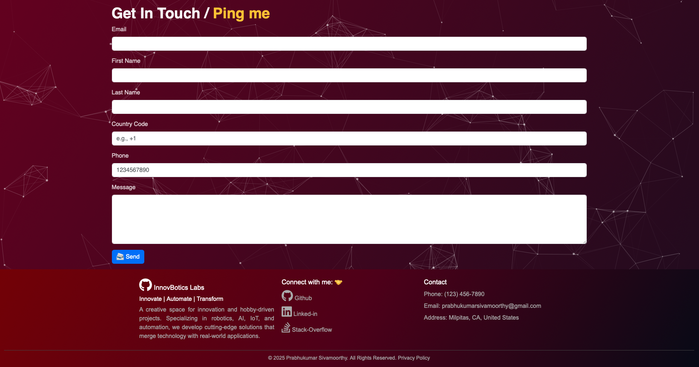
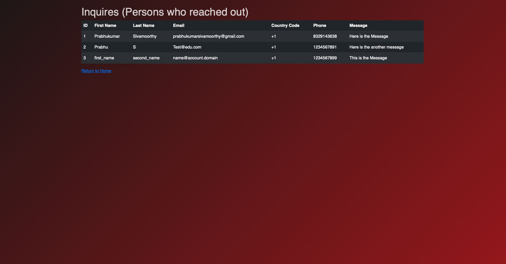
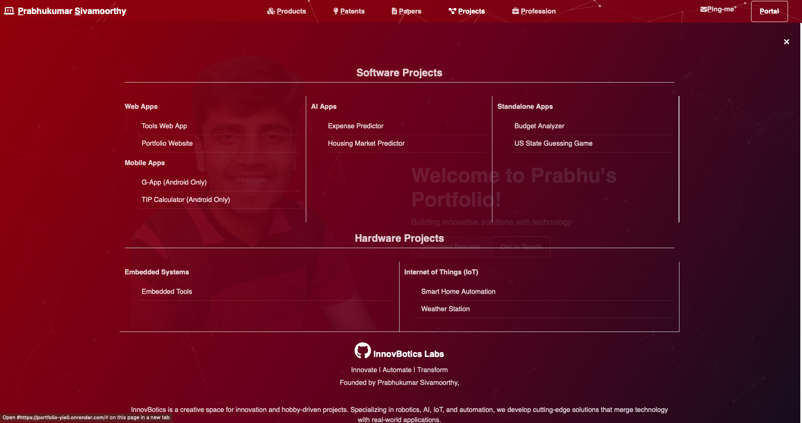
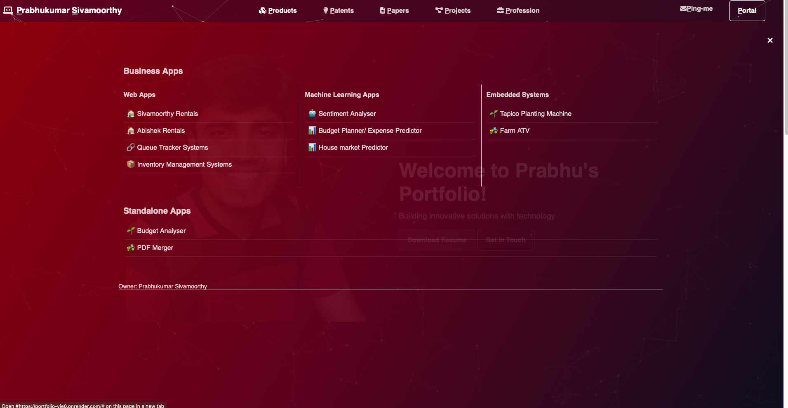
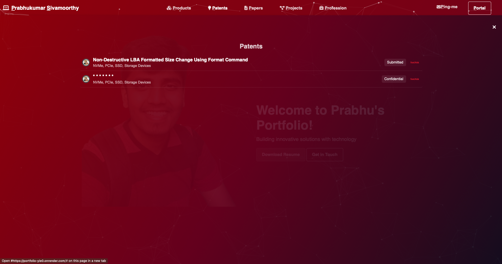
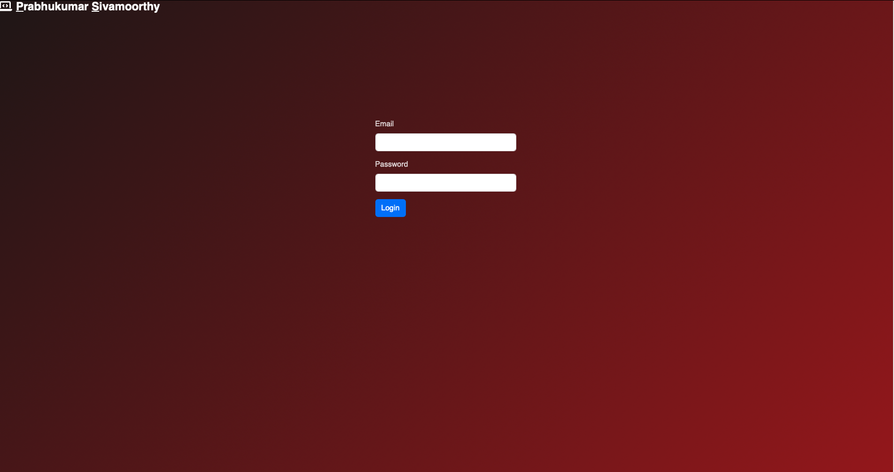
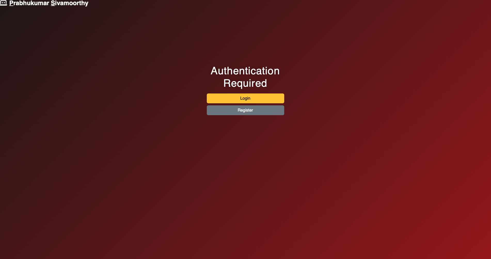

# Portfolio
Personal Portfolio Website
A custom-built personal website designed to showcase my self-developed products, ongoing projects, patents, and research publications. The platform also features a comprehensive career timeline, providing a structured overview of my professional journey. Additionally, the website includes a contact section for seamless communication, allowing visitors to connect with me directly. Built with a focus on usability and a clean interface, this website serves as a central hub for my work and professional engagements.

Skills: Python · Flask · Bootstarp · PostgreSQL · Pandas · NumPy · HTML5 · JavaScript

## Active LINK [here](https://portfolio-yie0.onrender.com/)

## HomePage

## Career Timeline

## Get in Touch Page

## Projects

## Products

## Patents

# Login Pages

